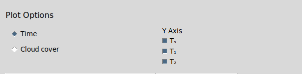

# Climate Predictor Package 

      <a href="https://climate-predictor.readthedocs.io/en/latest/"><strong>Explore the docs </strong></a>
     
     
      .
      <a href="https://github.com/NERC-DTP-Students/climate-predictor/issues">Report Bug</a>
      .
      <a href="https://github.com/NERC-DTP-Students/climate-predictor/issues">Request Feature</a>

<!-- TABLE OF CONTENTS alter this when readme is finalised -->

  
Table of Contents

  <ol>
    <li><a href="#basics">Basics</a></li>
    <li><a href="#installation">Installation</a></li>
    <li><a href="#scientific-background">Scienitific Background</a></li>
    <li><a href="#usage">Usage</a></li>
    <li><a href="#example">Example</a></li>
    <li><a href="#documentation">Documentation</a></li>
    <li><a href="#contributing">Contributing</a></li> 
    <li><a href="#license">License</a></li>
    <li><a href="#contact">Contact</a></li>
    <li><a href="#acknowledgments">Acknowledgments</a></li>
    <li><a href="#issues">Issues</a></li>
  </ol>

## **Basics**

This package predicts planet surface temperature as the result of changing cloud cover and land usage over a chosen period of time. The package is a standalone executable file that runs on Mac, Windows and Linux operating systems. All parameters can be changed within a GUI so there is no need to be familiar with any programming languages.

### **Two modes for customised use**
The default mode is for a investigating surface temperatures of the Earth. 

**Parameters**

+ Percentage cloud cover
+ Land usage propotions (ice, water, forest, desert)  

For each parameter the user sets an initial value and a change with time. A timeframe is selected and the global surface temperature over time is plotted.

The advanced option is for investigating surface temperatures of a generic planet.

**Paramters**
+ Albedo
+ &#949; 1 - emissivity of the first atmospheric layer
+ &#949; 2 - emissivity of the second atmospheric layer
+ S0 - flux from the star (defaults to present day Sun)

### **Adjustable and easy to use plotting tool**
A plot of temperature against a chosen input variable will be generated based on the user inputs. This plot can then be saved by the user by pressing one button. 

**Options**
+ X-axis (time, or any other parameter which changes with time)
+ Displayed temperature (any combination of surface temperature, temperature of atmospheric layer one and temperature of atmospheric layer two)

(<a href="#top">back to top</a>)

## Installation

(<a href="#top">back to top</a>)

## Scientific Background

(<a href="#top">back to top</a>)

## Usage

1. To launch the GUI - _something about the .exe file here_

2. Once the GUI is running input the initial values and change with time for cloud cover.

3. Choose current and final land coverage using either the sliders or the entry boxes beneath. **Entries in the boxes must be inputted in descending order i.e forest then ice etc.)**

4. Choose timespan to be investigated either using the slider or the input box. If a parameter which has a maximum value (e.g. albedo) is changing with time, the maximum timespan that can be investigated is the time taken for that parameter to reach its maximum value.

5. In the plot options select an x-axis and how many temperatures you want to be displayed.

6. The plot will automatically update.

7. Press save plot to save the plot.

(<a href="#top">back to top</a>)

## Example

In this simple example, shows change in surface temperature for a 10% increase in cloud cover every 50 years and all forest becoming desert over the same time period. _The numbers reference the steps in the Usage section above._

1. Launch the GUI

2. Input initial and change in cloud cover

3. Input initial and final land usage

4. Choose time interval and timespan to be investigated

5. Choose x axis and number of temperatures to be displayed

6. Plot automatically updates

(<a href="#top">back to top</a>)

## Documentation
The package is fully documented on <a href="https://climate-predictor.readthedocs.io/en/latest/index.html"><strong>ReadTheDocs</strong></a>

(<a href="#top">back to top</a>)

## Contributing
If you would like to contribute to the project, please get in touch with one of the members of the GitHub organisation <a href="https://github.com/NERC-DTP-Students/people">NERC-DTP-Students </a> and ask to be added as a collaborator.

This project and everyone participating is expected to follow a basic Code of Conduct:
+ Treat all others with respect and dignity.
+ Offer constructive feedback to others' contributions; never be deameaning or dismissive.

Contributors deemed to be in violation of the code of conduct will be removed from the repository.

The general workflow for contributing to the project is as follows:
+ Create an issue on GitHub.
+ Ensure your local copy of the repository is up to date, and branch the repository with a sensible name beginning with the issue number, e.g. '45-solver-broken'.
+ Fix the issue, commit your changes to the branch and push to GitHub. Ensure your commit message includes the issue number, e.g. "#45 Fixed Solver file"
+ Create a pull request for your branch to be merged with the master.
+ This will be reviewed by another collaborator, and then merged with the master.
+ The branch should now be deleted.

You can find the style information in the flake8 file in the repository.

If you have any questions, please contact one of the members of the organisation, as above.

(<a href="#top">back to top</a>)

## License
This package is distributed under the MIT license. For more information see <a href='https://github.com/NERC-DTP-Students/climate-predictor/main/license'>LICENSE</a>.

(<a href="#top">back to top</a>)

## Acknowledgements

+ Basic model inspired based on <a href='https://biocycle.atmos.colostate.edu/shiny/2layer'>this diagram </a>
+ GUI theme based on: <a href='https://github.com/rdbende/Sun-Valley-ttk-theme'> this template.</a>

(<a href="#top">back to top</a>)

## Issues
This project is still in development - for a full list of ongoing issues or to report a bug please see the <a href='https://github.com/NERC-DTP-Students/climate-predictor/issues'>Issues</a> tab.   
  

(<a href="#top">back to top</a>)

